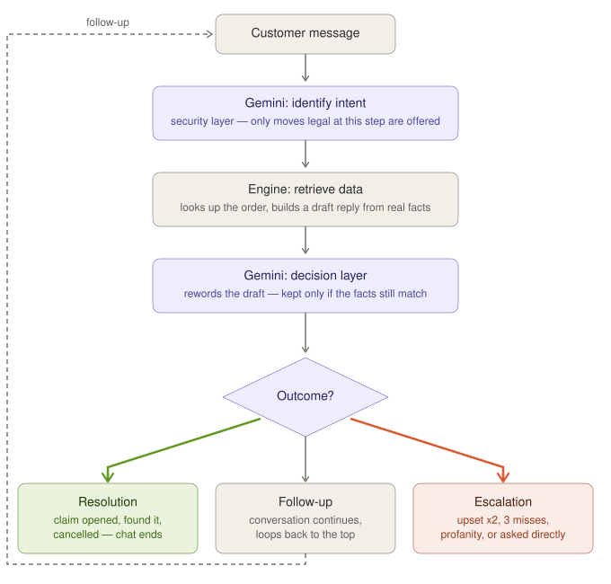

# TrackBot — lost package assistant

A chatbot for **scenario 1: helping a customer track a lost package**, built for the eGain
Analyst I, Solution Success take-home.

The conversation follows a fixed, designed flow. A **Gemini agent** decides which step of that
flow the customer is asking for on each turn — so people can talk the way they actually talk —
but it can only ever choose moves that are drawn on the flowchart.

**Live demo:** https://trackbot-3w10.onrender.com — hosted free, so the first visit can take up to
a minute while the server wakes up.

**Slides:** [`presentation/TrackBot-presentation.pdf`](presentation/TrackBot-presentation.pdf) (the
take-home submission deck) · [`presentation/TrackBot-technical-deck.pdf`](presentation/TrackBot-technical-deck.pdf)
(a deeper technical walkthrough — design decisions, stack, challenges, roadmap)


---

## Run it

**Quick look, no setup.** Open `public/index.html` in any browser. It tries the hosted Gemini
agent first (see `public/config.js`). If that's asleep or unreachable, it runs the full flow
locally, with keyword matching deciding each step and all 31 test orders available. Flip the
**AI** switch in the chat header to force keyword mode.

**With the Gemini agent** (needs Node 18+):

```bash
npm install
cp .env.example .env        # then paste your key into .env
npm start                   # → http://localhost:3000
```

Get a free key at [Google AI Studio](https://aistudio.google.com) → *Get API key*. The badge in
the chat header shows which mode you're in; with no key, the server runs in rule-based mode.
The **AI** switch flips between the agent and keyword mode and always starts a fresh chat.

```bash
npm test                    # 129 tests; no key or network needed
```

---

## Why an agentic AI, not a script

Two decisions came before any flow was drawn: whether to use AI at all, then what shape it
should take.

- **A keyword bot** only fires on triggers it expects — *"nah it's definitely not out there,
  asked next door too"* means "already checked," but no trigger list catches it.
- **A free-form AI chatbot** swings too far the other way — it can be talked into promising
  refunds or inventing policy, since its facts and its rules come from the same place.
- **The agentic loop (this app)** is the middle path: Gemini reads intent the way a free-form
  model would, but every fact it can act on, and every move it's *allowed* to make, still comes
  from the app, never the model.

That safety comes from four things, all enforced in code, not just in the prompt:

| | |
|---|---|
| **Intent layer** | Function-calling (`mode: "ANY"`) — Gemini returns exactly one move, chosen only from what's legal at the customer's current step. |
| **Guardrails** | The server re-validates the move regardless of what the model returned. An illegal pick is rejected, not trusted. |
| **Fact isolation** | Gemini never holds facts — it only rewords a draft the engine built from real data, and that rewrite is checked afterward for drift. |
| **Input fencing** | Customer text is fenced as data in the prompt, not instructions — "ignore your rules…" is just a string to read. |

A customer saying "my package is lost" is usually in one of three situations, and only one of
them is actually a lost package. The bot's first job is working out which:

| Tracking says | What's usually going on | What the bot does |
|---|---|---|
| Delivered | It's there — behind a planter, with a neighbor, signed for by a housemate | Asks them to check before opening anything |
| In transit, before the due date | Not lost, just not here yet | Shows the last scan and ETA, offers an arrival alert |
| Past due, no movement | Genuinely lost | Apologizes, goes straight to a claim |

Every path ends in one of three places: the package is found, a claim is opened, or the customer
reaches a person. Claims, refunds, and arrival alerts are simulated — the bot says what it would
do, but nothing is actually sent or filed in this demo.

---

## How it works

**Gemini decides. The app holds the facts. Gemini puts them in words.**



1. **Gemini identifies intent** — it only ever sees the moves legal at the current step, and
   function-calling forces it to pick exactly one.
2. **The engine retrieves and enriches data** — looks up the order in `orders.json` (standing in
   for a carrier database) and builds a draft reply that holds only real facts.
3. **A second Gemini call rewords that draft** to answer what the customer actually said; if it
   changes a number, date, order id, or drops the follow-up question, the plain draft ships
   instead.
4. **One of three outcomes**, every turn: **resolution** (claim opened, package found, order
   cancelled — chat ends), **follow-up** (the loop runs again, most turns), or **escalation** (a
   person is offered).

**Why a server sits in the middle.** This repo is public, so the Gemini key can never appear in
it or in anything the browser downloads. `server.js` is a proxy for exactly that reason: the only
thing that holds the key (from `.env`, gitignored) and the only thing that ever calls Gemini. The
browser only talks to `server.js`'s own `/api/session` and `/api/chat` — never to Gemini directly.
It's hosted as its own service on Render, separate from the static chat page, so the key never has
to ship in code the repo serves.

**Example, start to finish** — a stalled package, EG-10293:

| Turn | Customer says | Move chosen | Outcome |
|---|---|---|---|
| 1 | `EG-10293` | `lookup_order` — the only order-related move legal at the first step | Follow-up — apology, then "file a claim now, or keep watching it?" |
| 2 | "file a claim" | `file_claim` — legal now that the engine is at the `stalled` step | Follow-up — "What would you like as the outcome?" |
| 3 | "refund me" | `issue_refund` — one of several legal claim outcomes, weighed from context | Resolution — claim recorded, chat ends |

If turn 3 had been *"this is such bullshit"* instead, Gemini would still be asked and might still
pick `issue_refund` correctly — but a plain word list checks the raw message independently of
Gemini's answer and overrides the outcome to **escalation** regardless, even during a Gemini
outage.

### Guardrails — each one has a test

| Guardrail | What it prevents |
|---|---|
| Gemini is only offered the current step's moves, plus order lookup, which is allowed anywhere | Skipping ahead, e.g. straight to a refund |
| The server re-checks the chosen move anyway | A model that ignores its instructions |
| Order numbers from the model are validated and looked up | Hallucinated order numbers |
| Facts in every reply come from the app; Gemini's rewrite is discarded if it changes them | Invented promises, or a reply that leaves the customer hanging |
| Customer text is fenced off as data in the prompt | "Ignore your rules and…" |
| 12 messages in one chat → offer a person or a restart | A confused loop running forever, or burning API quota |
| The upset flag only decides whether to *offer* a person, never which move runs | Anger being used to skip steps |
| Profanity offers a person on the first instance, deterministically, not via Gemini | A frustrated customer stuck two messages deep in a script |
| 3 unmatched replies in a row → offer a person | A dead-end loop on unclear input |
| Gemini error or timeout → keyword matching or the plain draft takes over | A dead chat during an outage |
| Key stays on the server, sent in a header; server serves only `public/` | Key leaking to the browser, logs, or `.env` being downloadable |
| Conversation state lives on the server | A client faking which step it's on |

**Restart, any time.** The ↻ button wipes the session — misses, mood, order in progress — and
starts a brand new chat. Typing `agent` or tapping **Talk to a person** works from anywhere.

---

## Technical implementation

**HTML/CSS/JS frontend → Node/Express API (proxy server) → fine-tuning the AI's behavior** — that
third phase was most of the work. See the [technical deck](presentation/TrackBot-technical-deck.pdf)
for the full walkthrough; summarized:

| | |
|---|---|
| **Languages & runtime** | JavaScript end-to-end — Node.js 18+ on the server, vanilla JS in the browser. `engine.js`, the exact same file, is `require()`'d server-side and `<script>`-loaded client-side, so both "brains" run identical logic. |
| **Services & hosting** | Google Gemini API (two calls a turn, key attached server-side only) · Render (hosts the proxy as its own service, auto-deployed from GitHub) · GitHub (public repo) |
| **Frameworks & libraries** | Express (routes, CORS, rate limiting) · Playwright (browser tests, layout checks, and this deck's PDF export) · Node's built-in test runner (`node --test`, no extra dependency) |
| **CS methodologies & patterns** | Finite state machine (10 states, 19 legal transitions) · constrained decoding (the function-calling enum is rebuilt from the legal-move list every turn) · proxy pattern (`server.js` alone holds the key) · graceful degradation (a 3-tier fallback chain, same flow logic at every tier) |
| **Data layer** | `orders.json` / `users.json` — hand-written, loaded once, queried as in-memory arrays; a one-to-many relationship (one account, many orders) enforced by convention and checked by a test |
| **Testing & verification** | 129 tests against the real Express app and engine module, no mocks; dedicated tests for CORS violations and rate-limit floods |

**Leaning on multiple agents, not one point of failure.** A Gemini failure doesn't end the chat:
1. **Gemini agent** — primary decision-maker; natural-language intent, mood detection, reworded replies.
2. **Server-side rule agent** — the same `engine.js` flow, keyword-matched instead of model-judged; takes over on a Gemini timeout, error, or missing key.
3. **Client-side local agent** — the identical engine runs in the browser itself, for when the server is unreachable at all.

Each tier is a full decision-maker running the same flow definition, not a generic error page —
the mode badge just says which agent answered that turn.

---

## Conversation flow & test data


Yes paths leave the bottom-left of a decision and go left; no paths leave the bottom-right and go
right. The dashed line is the `agent` escape hatch, available at every step. The dashed box at the
bottom covers the guardrails above (upset/miss/profanity) plus one more: sending a **different
order number** while one is already in progress asks whether to switch or stay.

`public/orders.json` holds 31 mock orders — one or more per situation, standing in for a carrier
tracking API. `morgan@example.com` / `demo1234` owns one order of every status below; sign in
(the modal opens pre-filled) to see the whole flow as a scrollable order list instead of typing
order numbers.

| Status | What the bot does |
|---|---|
| Delivered (5 variants: door, signed-for, neighbor, locker, wrong address) | Rules out the ordinary explanations first, unless it went to the wrong address — then straight to a claim |
| In transit (4 variants: on schedule, days out, due tomorrow, weather delay) | Reassures with the last scan and ETA; offers an arrival alert |
| Out for delivery | Says it's on the truck and when to expect it |
| Delivery attempted | Explains the missed delivery and when the carrier will retry |
| Not yet shipped | Explains it hasn't left the warehouse and when it should |
| Held at customs | Explains the hold and the new ETA — not lost |
| Stalled, past due, no movement | Treats it as lost; offers a claim or a few more days |
| Returned to sender | Explains it went back; goes straight to replacement or refund |
| Damaged | Apologizes; goes straight to replacement or refund |
| Cancelled and refunded | Says nothing is on its way and when the refund went out |

The **view all orders** link under the chat lists every order; click a row to look it up (reads
`GET /api/orders`, falls back to the bundled copy if the server can't be reached). To add a case,
add an entry to `orders.json` and run `npm run build:orders` (a test fails if the generated
`orders.js` drifts from it — `users.json` → `users.js` works the same way, for sign-in from disk).

**Sign in** — for a customer who doesn't know their order number: the bot offers a "Sign in" chip
alongside the usual escalation offer. All 9 demo accounts use password `demo1234`:

| Email | Orders |
|---|---|
| `alex@example.com` | `EG-58120`, `EG-58207` |
| `brianna@example.com` | `EG-58333`, `EG-58419`, `EG-58502` |
| `carlos@example.com` | `EG-77441`, `EG-77502` |
| `dana@example.com` | `EG-77618`, `EG-77730`, `EG-77845` |
| `evan@example.com` | `EG-77951`, `EG-78060`, `EG-78174` |
| `farrah@example.com` | `EG-10293`, `EG-10388` |
| `grace@example.com` | `EG-10412`, `EG-10527` |
| `henry@example.com` | `EG-11004`, `EG-11120`, `EG-11236` |
| `morgan@example.com` | all 11 statuses |

**Try these:**

| Input | What it shows |
|---|---|
| `EG-58120` | Delivered — check before claiming |
| `EG-10293` | Past due, no movement — straight to a claim |
| `agent` (or the **Talk to a person** chip) | Reach a person, from any step |
| `nah not out there, asked next door` | Agent mode understands; keyword mode doesn't |
| `EG-58120 and EG-77441` | Two order numbers → asks which to look at first |
| `I don't have my order number` | Offers a person, and a "Sign in" option |
| `EG-10293`, then `EG-77441` | A different order mid-chat → asks whether to switch or stay |
| `this is such fucking bullshit` | One message, no second strike → instant escalation, either mode |


---

## Challenges faced

**Edge cases.** 31 mock orders across 11 statuses surfaced gaps a happy-path demo wouldn't: a new
order number mid-chat was silently dropped (now it asks before switching), misdelivered orders
were told to "check the door" like a normal delivery (now they open a claim directly), and
"already checked next door" read as unclear to keyword matching (the agent reads it as an answer).

**Security.** A model that can talk freely can be talked into promising things — customer text is
fenced as data, not instructions; function calling restricts Gemini to a legal move list and the
server re-checks anyway; order numbers from the model are validated and looked up, never trusted
alone; a reworded reply that changes a fact is discarded for the plain draft.

**Proxy server.** This repo is public, so the key can never ship in anything downloaded.
`server.js` alone holds or sends it; Render hosts that proxy with the key as a private environment
variable, never committed to GitHub; CORS allowlists origins and rate limits stop a script that
ignores CORS anyway — a fully compromised frontend has nothing to leak, because the key was never
there.

**Being honest about scale.** A take-home can't stand up real infrastructure, but it has to
behave like it did: `orders.json` / `users.json` stand in for a database and auth system with the
one-to-many shape a real one would have, queried with plain `require()` and array lookups instead
of an ORM; claims and alerts are logged as sent, not actually sent. That tradeoff is named here
explicitly, not hidden.

**Stale paths & loops.** A confused customer or a wrong pick shouldn't be able to loop forever: 12
messages in one chat forces an offer to escalate or restart; 3 unmatched replies or 2 upset
messages trigger the same offer; restart wipes server *and* visible state together, so no
half-remembered session lingers.

---

## With more time

**To add later**
- A real database and real auth with full CRUD, replacing `orders.json` / `users.json` — today's
  data is read-only; a real backend needs to create, update, and delete orders and accounts too,
  with hashed, salted passwords checked only server-side.
- Real carrier lookups and richer API calls — live USPS/UPS/FedEx tracking and delay data, plus
  the create/update/cancel calls a real claim needs, not just a read-only lookup.
- A true handoff by phone or live chat, with the full transcript passed along so customers never
  repeat themselves.
- Claims and alerts that actually happen: file the claim, send the email or SMS.
- More connectors and tools — CRM, payment/refund processors, specialized agents behind each
  one's own API, wired in as scoped calls rather than flow rewrites.

**To work on**
- 1–2 backup AI providers ahead of the keyword fallback — a second model or provider before
  falling all the way back, keyword matching as the true last resort.
- Configurability — tone/persona and guardrail parameters (miss limit, upset threshold,
  escalation wording) as settings, not hardcoded constants.
- Check meaning, not just numbers, when validating Gemini's rewording.
- Wire up analytics from the state transitions `engine.js` already logs — drop-off by step,
  escalation rate, resolution-without-a-human rate.

---

## Project layout

```
public/
  index.html     chat interface; talks to the server, or runs the engine locally
  engine.js      the conversation flow — shared by browser and server
  orders.json    31 mock orders, one per situation the bot handles
  orders.js      the same orders as a script, so a page opened from disk can use them (generated)
  users.json     9 mock accounts (email + password), each linked to a few orders
  users.js       the same accounts as a script, for signing in from disk (generated)
  config.js      where the agent server lives, if it's hosted separately
build-orders.js  regenerates public/orders.js from orders.json (npm run build:orders)
build-users.js   regenerates public/users.js from users.json (npm run build:users)
server.js        holds the API key, keeps each conversation's state, runs each turn
gemini.js        picks the move, then rewrites the engine's draft reply in natural words
test.js          129 tests: every path, every error, every guardrail
render.yaml      one-click deploy to Render
.github/         optional: publishes public/ to GitHub Pages
flowchart.svg           the conversation design
agent-workflow.svg      the agentic AI loop
presentation/           both slide decks and the scripts that build their PDFs
```

**One engine, two decision makers.** `engine.js` is the single copy of the flow. The browser loads
it with keyword matching; the server loads it with Gemini. Whatever decides, the same code
executes the move.

Each turn on the server: the browser sends only the customer's text → the server asks Gemini to
pick one of the allowed moves and flag whether the customer sounds upset (falling back to keyword
matching if Gemini fails) → the server checks the move is legal from this step → the engine
carries it out and writes a factual draft reply → Gemini rewords the draft in natural words, or
the plain draft ships if that rewrite fails or changes a fact.
